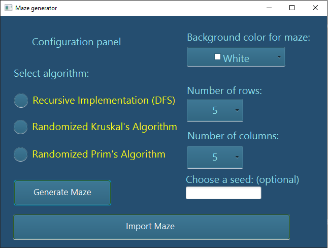
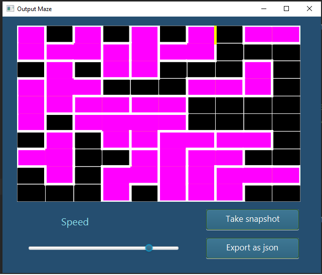

# Maze-Generator

## Contributors
- Burcă Rafael
- Petrariu Florin Iustinian 

## Description
> A maze is a path or collection of paths, typically from an entrance to a goal. There are many different approaches to generating mazes, with various maze generation algorithms for builing them, either by hand, or automatically by computer. Also, mazes, in general, can be organized along different classification, but the project focus is on 2D mazes which means that it's always possible to display the plan on the sheet of paper and navigate it wihtout overlapping any other passages. Our project implements three algorithms in order to generate the maze : Randomized depth-first search, Randomized Kruskal's algorithm and Randomized Prim's algorithm. 

## The purpose of the project
> This project has been made to reveal the process of generation for different mazes. Every maze is uniquely generated, step by step, by a seed (a number that sets up a pattern for the random number generator class). Also, your maze can be customized by choosing a color from a color picker form, being able to be exported in different formats, such as JSON files or PNG.

## The technology used
> The project is written in Java (using JavaFX software platform to provide a pleasant **UI**). Every layout of the application is designed in a FXML (native XML for JavaFX) file, being also styled by a CSS file.
## GUI Mode 

>By default , the generations of the mazes will be animated, showing the current path being added to the maze at each step of the process. Also, *speed* slider can also be adjusted to increase or decrease the delay between steps in the animation. You can also choose the maze size for adjusting the size of the maze. Moreover, you cand select between three algorithms and also pick a color that you want. Finally, if you want to eport whis maze you can do this by clicking the *export* button and also you can *import* a generated maze. 
> Here are some screenshots of the program running

## Implementation detalis

1. *Randomized depth-first search*
>The behaviour of this algorithm is similar to a **DFS**(depth-first search) algorithm. It starts from a cell and the algorithm selects the next the next neighbour call that has not been visited (accordingly to the seed pattern). The computer removes the wall between the two cells and marks the new cell as visited, finally adding it to the stack in order to facilitate the recursion. This process continues until every cell has been visited, causing the computer to backtrack all the way back to the beginning cell.

2. *Randomized Kruskal's algorithm*
>This algorithm is a randomized version on Kruskal's algorithm. An efficient implementation is given using a disjoint-set data structure that can perform each union and find operation on two sets in nearly constant amortized time. The algorithm create a list of all wals, and also create a set for each cell, each containing just that one cell . Then, for each wall, in a random order if the cells divided by this wall belong to distinct sets then remove the current wall and join the sets of the formerly divided cells.

3. *Randomized Prim's algorithm*
>The algorithm is a randomized version of Prim's algorithm. The flow of the algorithm starts with a grid full of wals, then pick a cell (at random) and mark it as part of the maze. Add the walls of the cell to the wall list and while there are walls in the list : pick a random wall from the list and check if only one of the two cells that the wall divides is visited then make the wall a passage and also mark the unvisited cell as part of the maze. Moreover, add the neighboring walls of the cell to the wall list. Finally, remove the wall from the list.

## Contribution
>The contributors have worked simultaneously at the project by sharing the project using Live Share (a Visual Studio Code plugin). Basically every participant worked equally

## License
**GNU GENERAL PUBLIC LICENSE**
